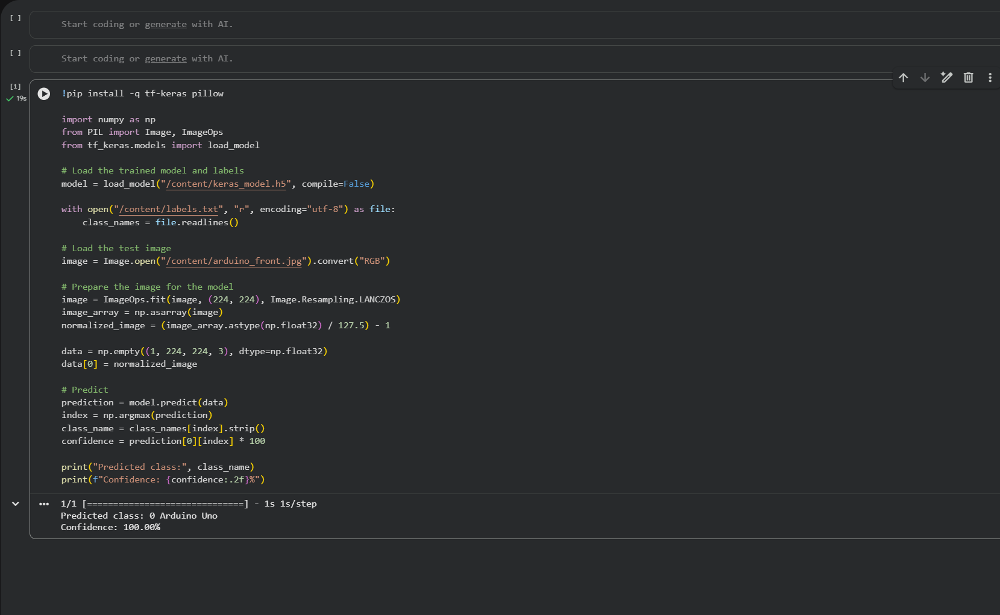
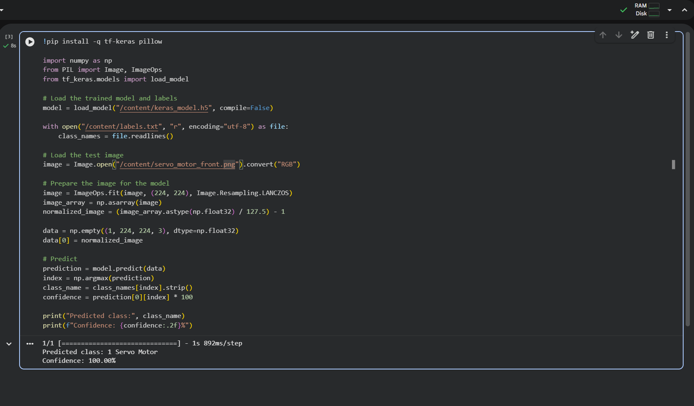
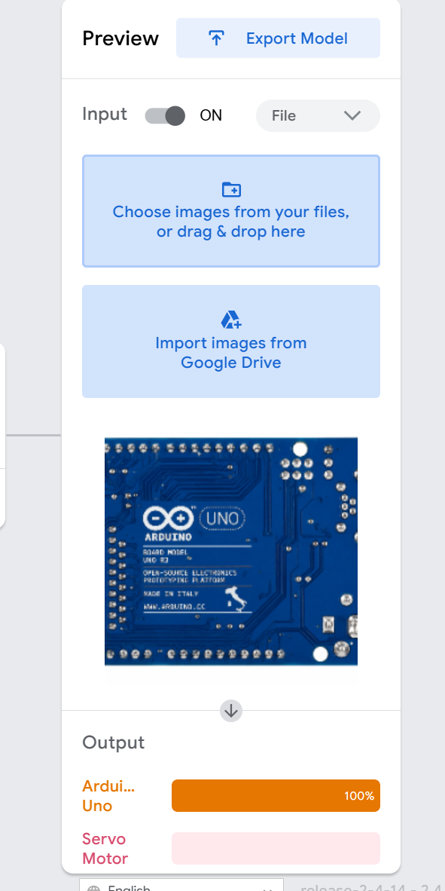
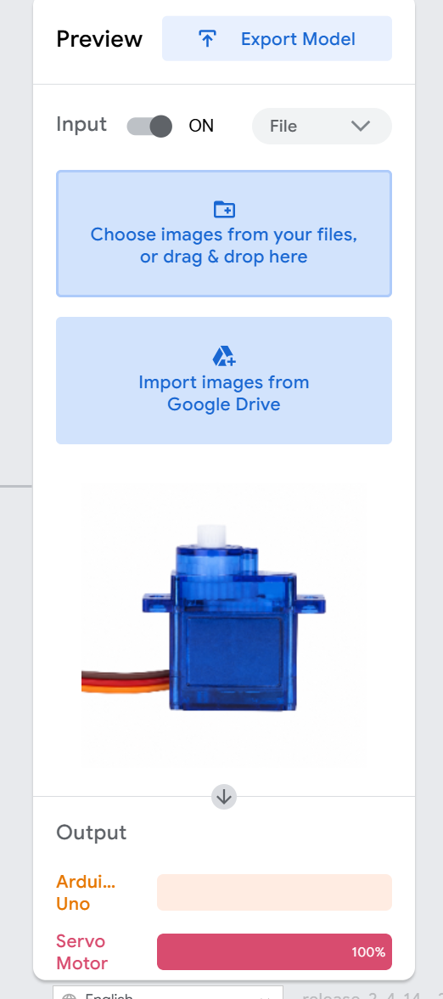

# Arduino Uno and Servo Motor Image Classification

## Project Overview

This project is an image classification model developed using Google Teachable Machine, TensorFlow Keras, and Python.

The model was trained to recognize and classify two robotics components:

- Arduino Uno
- Servo Motor

## Project Objective

The objective of this project is to train an image recognition model that accepts an input image and predicts whether the object is an Arduino Uno or a Servo Motor.

## Image Classes

### Class 1: Arduino Uno

The model was trained using four images of an Arduino Uno from different views:

- Front view
- Underside view
- Right-side view
- Left-side view

### Class 2: Servo Motor

The model was trained using four images of a Servo Motor from different views:

- Front view
- Bottom view
- Right-side view
- Left-side view

## Tools and Technologies

- [Google Teachable Machine](https://teachablemachine.withgoogle.com/)
- [Google Colab](https://colab.research.google.com/)
- Python
- TensorFlow
- Keras
- NumPy
- Pillow
- GitHub

## Project Workflow

1. Selected two robotics components: Arduino Uno and Servo Motor.
2. Collected four images for each component from different views.
3. Created two image classes in Google Teachable Machine.
4. Uploaded the images to their corresponding classes.
5. Trained the image classification model.
6. Tested the model using sample images.
7. Exported the trained model in TensorFlow Keras format.
8. Uploaded the exported model files to Google Colab.
9. Created a Python script to load the model and classify an input image.
10. Tested the Python script using Arduino Uno and Servo Motor images.
11. Uploaded the Python script, model files, labels, and output screenshots to GitHub.

## Model Files

- [Python Classification Script](predict.py)
- [Keras Trained Model](converted_keras/keras_model.h5)
- [Class Labels](converted_keras/labels.txt)

## How the Python Script Works

The Python script performs the following steps:

1. Imports the required Python libraries.
2. Loads the exported Keras model.
3. Loads the class labels from labels.txt.
4. Opens the selected test image.
5. Resizes the image to 224 × 224 pixels.
6. Normalizes the image data.
7. Sends the processed image to the trained model.
8. Determines the predicted class.
9. Displays the predicted class and confidence percentage.

## Arduino Uno Prediction Result

The model correctly classified the Arduino Uno sample image.

Predicted Class: Arduino Uno  
Confidence: 100.00%

## Servo Motor Prediction Result

The model correctly classified the Servo Motor sample image.

Predicted Class: Servo Motor  
Confidence: 100.00%

## Repository Structure
arduino-servo-image-classification/
│
├── converted_keras/
│   ├── keras_model.h5
│   └── labels.txt
│
├── predict.py
├── python_arduino_output.png
├── python_servo_output.png
└── README.md

## How to Run the Project

1. Open the project using Google Colab or another Python environment.
2. Upload the following files:
   - keras_model.h5
   - labels.txt
   - The test image
3. Update the test image path inside predict.py.
4. Run the Python script.
5. The predicted class and confidence percentage will appear in the output.

## Teachable Machine Test Results

### Arduino Uno

The model correctly recognized the Arduino Uno using the Teachable Machine testing interface.

Predicted Class: Arduino Uno  
Confidence: 100%

### Servo Motor

The model correctly recognized the Servo Motor using the Teachable Machine testing interface.

Predicted Class: Servo Motor  
Confidence: 100%

## Conclusion

This project demonstrates how image classification can be used to recognize robotics components. Google Teachable Machine was used to train the model, while Python and TensorFlow Keras were used to load the exported model and make predictions.

## Author

Reem Al-Wadaei

Developed as part of the Robotics Engineering Training Program.
